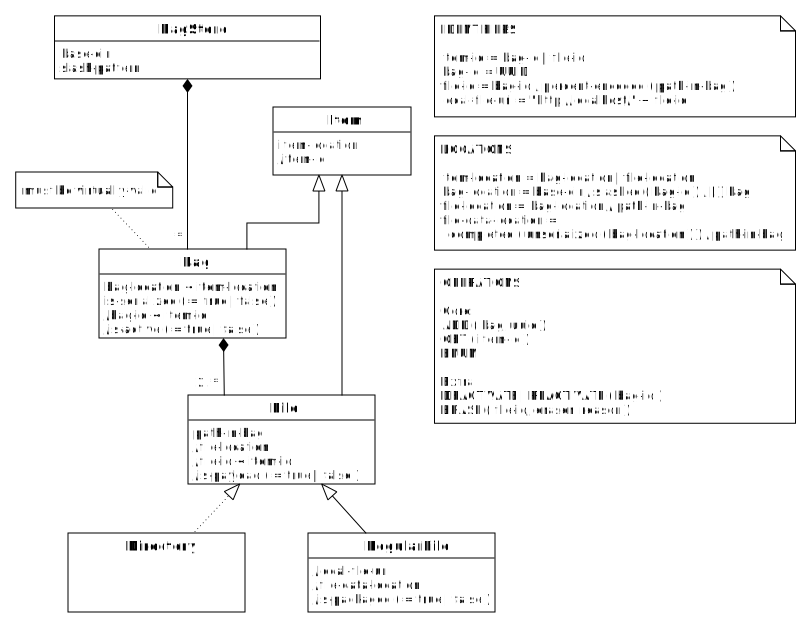

TABLE OF CONTENTS
-----------------

- [Introduction](#introduction)
- [Summary](#summary)
  * [In two sentences](#in-two-sentences)
  * [In one picture](#in-one-picture)
- [Objects & attributes](#objects---attributes)
  * [BagStore](#bagstore)
  * [Bag](#bag)
  * [Item](#item)
- [Operations](#operations)
  * [Core](#core)
  * [Extra](#extra)
- [Examples](#examples)
- [Migrations](#migrations)
  * [Merge BagStores](#merge-bagstores)
  * [Split BagStore](#split-bagstore)
  * [Change bag-id slashing](#change-bag-id-slashing)
- [Technical considerations](#technical-considerations)
  * [Slashing the bag-id](#slashing-the-bag-id)

Introduction
------------
A bag store is a way to store and identify data packages following a few very simple rules. This 
document intends to describe the bag store in a terse and quasi-formal manner. See the [tutorial] 
for a more elaborate, hands-on introduction.

[tutorial]: 04_tutorial.html

Summary
-------

### In two sentences
A [**BagStore**](#bagstore) is a collection of immutable, [**virtually-valid** **Bag**s](#bag) stored under 
a common [**base-dir**](#bagstore). Each [**Item**](#item) in the BagStore has an [**item-id**](#item-id)
and an [**item-location**](#item-location) with simple mapping rules to translate between them. 

### In one picture
   

#### Remarks
* The notation `bag-id < item-id` means that a bag-id is a special kind of item-id.
* A slash preceding an attribute signifies that it is derivable from other attributes.

Objects & attributes
--------------------
### BagStore
The collection of Bags stored under a common base directory (**base-dir**). It uses a single **slash-pattern**
(see [item-location](#item-location)).

### Bag
The elements of the BagStore are Bags, i.e. directories or archive files conforming to the [BagIt] 
specifications. The Bags must be virtually-valid. They may be active or inactive.

#### virtually-valid
A Bag is virtually-valid if:

- it is [valid], or
- it is incomplete, but contains a [`fetch.txt`] file and can be made valid by fetching the files
  listed in it and removing `fetch.txt` and its corresponding checksums from the Bag. If 
  [local-file-uris](#local-file-uri) are used, they must reference RegularFiles in the same BagStore.
  
#### (in)active  
A Bag in a BagStore is inactive if its name starts with a full stop character. It is active otherwise.

### Item
An **Item** is a Bag, or a **File** in a Bag. A File may be a **RegularFile** or a **Directory**. 
Each Item has an **item-id**. 

#### item-id
The item-ids are defined as follows:

- **bag-id** = `<uuid>`, that is a [UUID] represented as lowercase hexadecimal digits, with optional hyphens,
  to group these.
- **file-id** = `<bag-id>/percent-encoded-segments(<path-in-bag>)`, where:

  - **percent-encoded-segments** means that to each path segment [percent-encoding] is applied to 
    all characters except (English) alphanumericals and the underscore character. When percent-encoding a
    character, the [UTF-8] representation must be used as input.

  - **path-in-bag** is the relative path of the File in the bag, after `fetch.txt` has been resolved.
  
#### item-location
The item-locations are defined as follows:

- **bag-location** = `<base-dir>/slashed(<uuid>)/[.]<bag>`, where:
 
    - **slashed** means that the UUID is stripped of hyphens and then subdivided into several groups 
      of characters, with the slash as separator, forming a file path. The number of slashes to insert 
      and where to insert them is specified by the **slash-pattern**.
  
    - **bag** the name of the Bag. For an unserialized Bag this is the name of the base directory, for a serialized
      Bag the name of the archive file containing it, including the extension, such as `.tar` or `.7z`. The
      base directory of the bag must always be the same as base name of the serialized bag.
      
    - the **dot**, if present, means that the bag is [inactive](#inactive).
      
- **file-location** = `<bag-location>/<path-in-bag>`. A RegularFile may have a [**file-data-location**](#file-data-location)
  and a Directory may not have one unique location that contains all the Files in it.
  

#### file-data-location
The file-data-location is the location where the RegularFile's data is actually stored (in the
case of an unserialized Bag), or where it *would* be stored if a serialized Bag were unserialized and
completed in-place. (Note the conditional, however, as actually performing unserialization and completion
in-place is not permitted.) 

- **file-data-location** = `completed(unserialized(<bag-location>))/path-in-bag`, where:

    - **unserialized** means the Bag after unserializing it in-place.
    - **completed** means the Bag after fetching the Items in `fetch.txt`, if present.
   
#### local-file-uri
For RegularFile we define a local-file-uri. This may, but does not need to be resolvable through a web server.
It is intended to be used in `fetch.txt`, to obviate the need for storing the exact same file multiple times in the same 
BagStore.

 - **local-file-uri** = `http://localhost/<file-id>`

[BagIt]: https://tools.ietf.org/html/draft-kunze-bagit
[valid]: https://tools.ietf.org/html/draft-kunze-bagit#section-3
[UUID]: https://en.wikipedia.org/wiki/Universally_unique_identifier
[percent-encoding]: https://tools.ietf.org/html/rfc3986#section-2.1
[UTF-8]: https://tools.ietf.org/html/rfc3629
[`fetch.txt`]: https://tools.ietf.org/html/draft-kunze-bagit#section-2.2.3

Operations
----------
On a BagStore the following operations are allowed.

* `ADD` - add a virtually-valid Bag to the BagStore.
* `ENUM` - enumerate all the Bags in the BagStore.
* `GET` - copy a Bag or an non-packaged RegularFile from the BagStore.
* `DEACTIVATE` - mark a Bag as inactive.
* `REACTIVATE` - reverse a deactivation.

Note that this means that Bags are immutable. To support updates to Bags, add metadata that records
that a Bag is part of a sequence of Bags, that together form the revision history of one logical 
(and mutable) Bag. See for an example implementation the [easy-bag-index] project.

The `DEACTIVATE` operation marks a Bag as inactive. This involves marking the Bag directory as hidden
by prepending its name with a dot. Note that this operation does not require copying or modifying any
File data. The only "file" that is modified is the directory containing the Bag. On some file systems
this may still require write-privileges on the bag-base-dir.

### Extension
Some use cases may require bag data to be deleted, for example for legal reasons. For those special cases, an
extra operation is defined:

* `ERASE` (optional) - erase the contents of a particular Bag **payload** File, and update the corresponding
  entries in any affected payload manifests accordingly.

[easy-bag-index]: https://github.com/DANS-KNAW/easy-bag-index
[Migration]: #migrations
[core]: #core
[extra]: #extra

Examples
--------
Given are a bag store with a base-dir of `/srv/dans.knaw.nl/bag-store/`, and slash-pattern (2,30).

1. If we store a bag named `example` in the store under UUID `75444957-009d-4289-aae7-270342ce27d4`,
   bag-location will be: 
 
       /srv/dans.knaw.nl/bag-store/75/444957009d4289aae7270342ce27d4/example/

2. If we store it serialized as a TAR archive, the bag-location will be:
   
       /srv/dans.knaw.nl/bag-store/75/444957009d4289aae7270342ce27d4/example.tar

3. If `example` contains a regular file at `data/my document.txt`, relative to the bag's base directory,
   its file-id will be:

       75444957-009d-4289-aae7-270342ce27d4/data/my%20document.txt
   
   and its local-file-uri:
   
       http://localhost/75444957-009d-4289-aae7-270342ce27d4/data/my%20document.txt
   
4. Now the other way around. Suppose we know the bag-id of a bag to be `5489c18e-324b-4873-92b8-5d324775c183`.
   To look for it in our bag store, we should look in the following directory:
   
       /srv/dans.knaw.nl/bag-store/54/89c18e324b487392b85d324775c183/
       
   There must only be one file in this directory, which may be either a directory or an archive file. In the
   former case it is an unserialized bag in the latter a serialized bag.
   
5. To look up the file-id `5489c18e-324b-4873-92b8-5d324775c183/data/is/here.txt` we can follow the following
   procedure:
   
     1. Find the file or directory in 
     
            /srv/dans.knaw.nl/bag-store/54/89c18e324b487392b85d324775c183/
            
     2. Let's say it is a directory named `my-bag`. Now look at the location:
     
            /srv/dans.knaw.nl/bag-store/54/89c18e324b487392b85d324775c183/my-bag/data/is/here.txt
            
     3. If it there, you are done, otherwise check for the existence of the file:
            
            /srv/dans.knaw.nl/bag-store/54/89c18e324b487392b85d324775c183/my-bag/fetch.txt
           
     4. If there is no `fetch.txt` the file is not present in the bag store. If there is, find the entry
        that fetches the file for the local path `data/is/here.txt`. If it is  local-file-uri, resolve it
        to a file-id and repeat this same procedure for the file. If it is a non-local URL, dereference 
        that URL using the protocol specified in its scheme-part.
 
Compatiblity with Archival Resource Keys
----------------------------------------
Although item-ids are not Archival Resource Keys ([ARK]s) by themselves, they can be used to mint ones. All that is
needed is Name Assigining Authority Number (NAAN). Optionally, a Name Mapping Authority Hostport can be provided to 
resolve ARKs over http. 

An ARK has the following general form:

    [http://NMAH/]ark:/NAAN/Name[Qualifier]

All that is needed is to fill in the item-id for the combined `Name[Qualifier]` part. The `bag-id` fulfills the roles of 
`Name` and, in the case of a FileItem, `/percent-encoded-segments(<path-in-bag>)` is the `Qualifier`. 

Note that the definition of [`percent-encoded-segments`](#item-id) ensures that the resulting string is a syntactically valid ARK and that it 
can be used without problems as part of an HTTP URL. The characters that can appear unencoded (the alphanumericals and underscore):
 
 * all are part of the ARK character repertoire and (except `/`) have no special semantics in ARK;
 * the `/` is used as a hierarchical delimiter, and therefore has the semantics required by ARK;
 * all are member of the set of [URI unreserved characters] and thus have no special semantics in a URI.

The `Name` part is not percent-encoded. Since it is a UUID in lowercase hexadecimal digits, optionally grouped by hyphens, the characters
that can appear in this part are all member of the set of [URI unreserved characters].
 
[ARK]: http://n2t.net/e/arkspec.txt
[URI reserved characters]: https://tools.ietf.org/html/rfc3986#section-2.2
[URI unreserved characters]: https://tools.ietf.org/html/rfc3986#section-2.3
        
 
Migrations
----------  
A **Migration** is a BagStore-wide transformation. The input of a Migration is always one or more BagStores. The output
may in principle be anything depending on the Migration procedure. Below we will define some Migrations whose outputs are also one or
more BagStores. Migrations are riskier than normal operations and should normally be avoided.

### Merge BagStores
Merging two BagStores can be done in at most two steps:

1. Harmonize the slashing settings of both BagStores. (This can of course be equal to the settings of one of the existing BagStores.)
2. Copy the base-dirs and their contents to the new base-dir. (Again, this can be one of the existing base-dirs.)

If the slashing settings are already equal, this step can be foregone.

### Split BagStore
Splitting a BagStore is a bit more involved, because BagStores must not include files by reference from other BagStores. It is therefore
necessary to determine which bags form a self-contained sub-set:

1. Determine which bags you want to split off.
2. For each bag determine if it has `fetch.txt` that includes Files, add the Bag that actually contains them to the BagStore to be
   split off, recursively.

### Change bag-id slashing
This Migration only changes directory names:

1. From base-dir downwards find the last directory-level that has the desired name-length already. 
2. In each directories at this level:
   
   1. For each bag contained in the directory:

      1. Remove the slashes from the remaining path to the bag
      2. Insert the slashes in the remaining path in the new positions
      3. Move the bag to the location pointed to by the new remaining path.

Technical considerations
------------------------

### Slashing the bag-id

The rationale for this is that some file systems suffer a performance loss when a directory gets overfull. By distributing the
contents of the BagStore over subdirectories this problem is avoided. How deep to make the directory tree depends on the
number of (expected) Bags. However, note that it is relatively easy to change this later on, with a series of move operations.
In most (all?) file systems this means no data needs to be actually copied if the BagStore is contained in a single 
storage volume.